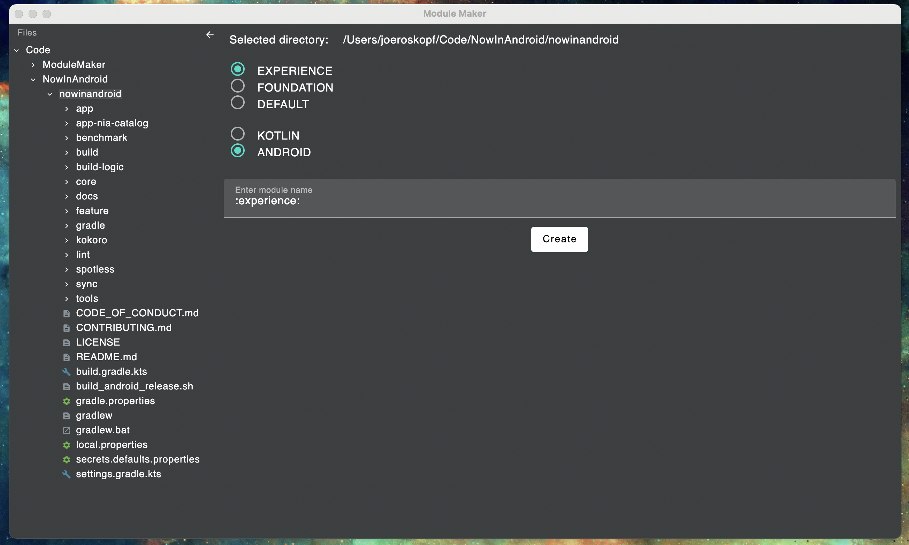
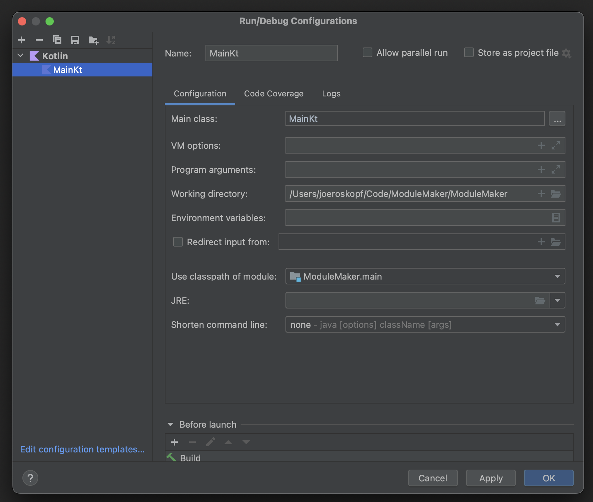

# Module Maker

## What is this?

As we create more modules, it will become useful to be able to create a module from a template. This is a desktop compose application that allows one to create modules without having to copy / paste / modify existing modules.

## Example

https://user-images.githubusercontent.com/7951665/201574884-0de4e082-757f-426a-97f9-8b027036dc88.mov

## How to contribute
1. Download [IntelliJ](https://www.jetbrains.com/idea/download/)
2. Make relevant changes
3. Test said changes. You can either create a new run configuration like so 
   1. 
   2. Or you can run via gradle with `./gradlew run`
   3. Click the green play icon in the `main()` function
   
## Generating binaries
Right now, generating a binary wouldn't be super useful for us because the path assumed in the code is that of the path of the folder. It is a future enhancement to make this a standalone application.
But to generate new binaries, you have to have at least Java 15 set as your default, and then you can run `./gradlew package` and you will see the relevant `.dmg` and `.app` binaries in the `/build/compose/binaries/main/` folder. To create a jar, execute `./gradlew packageUberJarForCurrentOS` which will generate a jar for the current OS in `/build/compose/jar`

There is a helpful bash script to generate a new jar and include it at the base directory of this project that can be executed via `./packageAndRun.sh`. This method works with Java 11.

## Further Reading / Documentation
1. https://github.com/JetBrains/compose-jb
2. [FreeMarker template language](https://freemarker.apache.org/)

