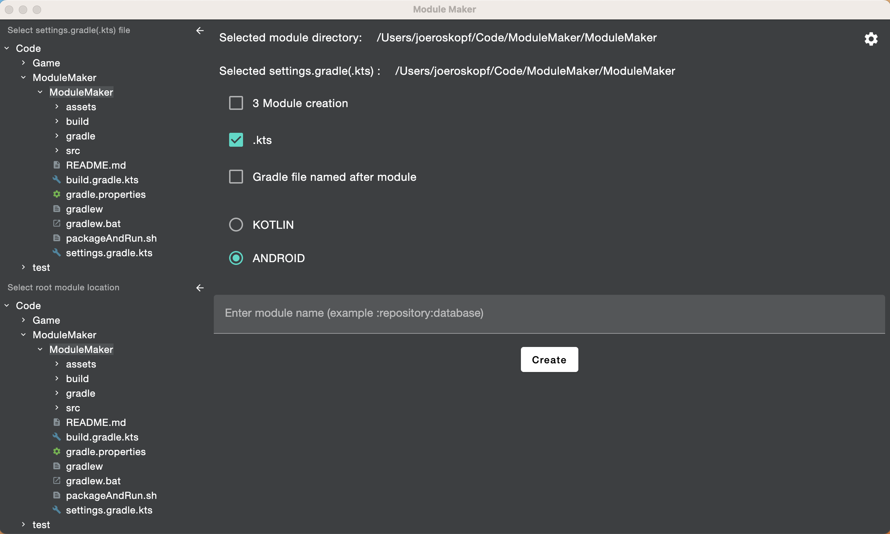
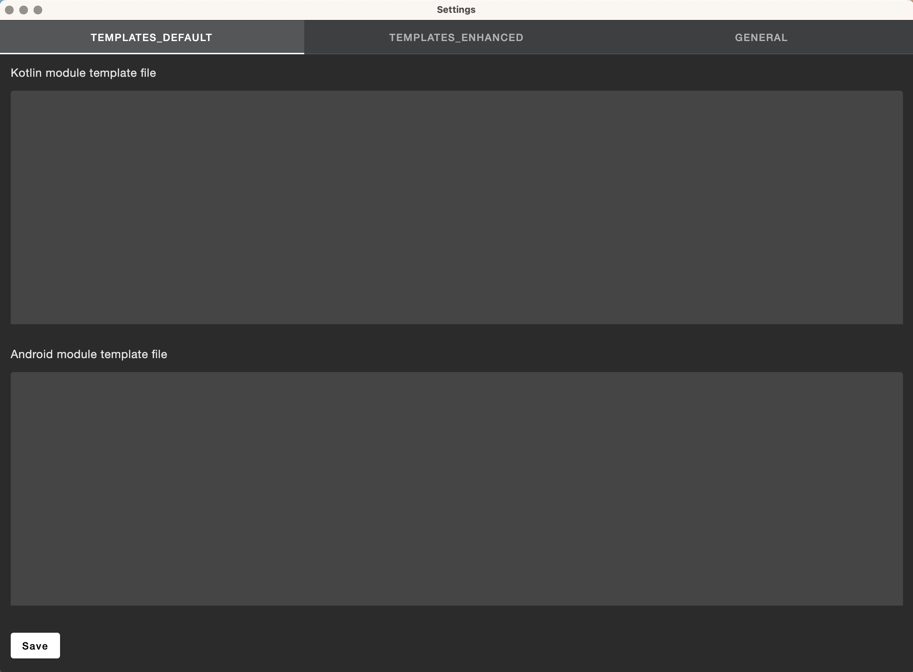
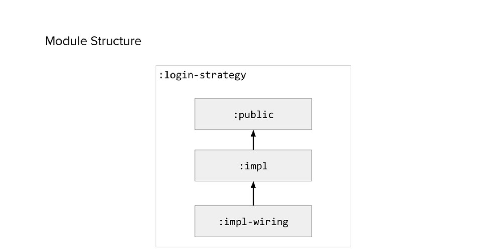

# Module Maker

## What is this?

As we create more modules in Android applications, it will become useful to be able to create a module from a template. This is a desktop compose application that allows one to create modules without having to copy / paste / modify existing modules.

## What is supported

Currently, you can generate Kotlin or Android modules. A barebones template is provided for each, but can also be overridden by navigating to the settings page and adding your own template.

You can also have a created module follow an 'enhanced' structure. This 'enhanced' structure is based off Square's sub-modularization strategy.

 

The default names that have been chosen for now are `:api` (analogous to `:public`) `:impl` (analogous to `:impl`) and `:glue` (analogous to `:impl-wiring`)

## Example

https://user-images.githubusercontent.com/7951665/201937365-a0051858-a154-4691-91e5-9850a393c4b3.mov

## How to contribute
1. Download [IntelliJ](https://www.jetbrains.com/idea/download/)
2. Make relevant changes
3. Test said changes. You can either create a new run configuration like so
1. 
2. Or you can run via gradle with `./gradlew run`
3. Click the green play icon in the `main()` function

## Generating binaries
To generate new binaries, you have to have at least Java 15 set as your default, and then you can run `./gradlew package` and you will see the relevant `.dmg` and `.app` binaries in the `/build/compose/binaries/main/` folder. To create a jar, execute `./gradlew packageUberJarForCurrentOS` which will generate a jar for the current OS in `/build/compose/jar`

There is a helpful bash script to generate a new jar and include it at the base directory of this project that can be executed via `./packageAndRun.sh`. This method works with Java 11.

## Further Reading / Documentation
1. https://github.com/JetBrains/compose-jb
2. [FreeMarker template language](https://freemarker.apache.org/)
